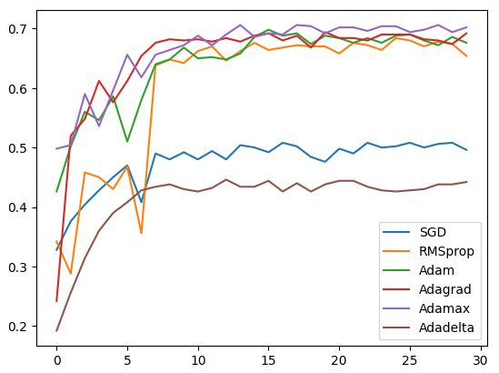

This repository contains jupyter notebooks for train and inference resnet18. 
The folder `models` contains models that were trained using various optimization algorithms

## Dataset
For training,  was used the dataset at the link:
[Google drive](https://drive.google.com/file/d/1qegZD6dsy7Po_2ehFqow5ZOSc8ZFFKQw/view?usp=share_link)

This dataset is part of the (10 classes) [dataset](https://www.kaggle.com/datasets/ambityga/imagenet100).

## Current accuracy
