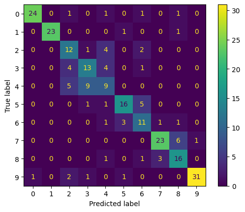

This repository contains jupyter notebooks for train and inference resnet18. 
The folder `models` contains models that were trained using various optimization algorithms

## Dataset
For training,  was used the dataset at the link:
[Google drive](https://drive.google.com/file/d/1qegZD6dsy7Po_2ehFqow5ZOSc8ZFFKQw/view?usp=share_link)

This dataset is part of the (10 classes) [dataset](https://www.kaggle.com/datasets/ambityga/imagenet100).

## Current accuracy

## Confusion matrix
Metrics are taken from the model that was trained with the Adamax algorithm  

## Metrics
|              | precision | recall | f1-score | support |
|-------------:|----------:|-------:|---------:|--------:|
|            0 |      0.96 |   0.86 |     0.91 |      28 |
|            1 |      1.00 |   0.92 |     0.96 |      25 |
|            2 |      0.50 |   0.63 |     0.56 |      19 |
|            3 |      0.52 |   0.59 |     0.55 |      22 |
|            4 |      0.43 |   0.39 |     0.41 |      23 |
|            5 |      0.76 |   0.70 |     0.73 |      23 |
|            6 |      0.52 |   0.65 |     0.58 |      17 |
|            7 |      0.85 |   0.77 |     0.81 |      30 |
|            8 |      0.64 |   0.76 |     0.70 |      21 |
|            9 |      0.97 |   0.86 |     0.91 |      36 |
|              |           |        |          |         |
|     accuracy |           |        |     0.73 |     244 |
|    macro avg |      0.72 |   0.71 |     0.71 |     244 |
| weighted avg |      0.75 |   0.73 |     0.74 |     244 |
